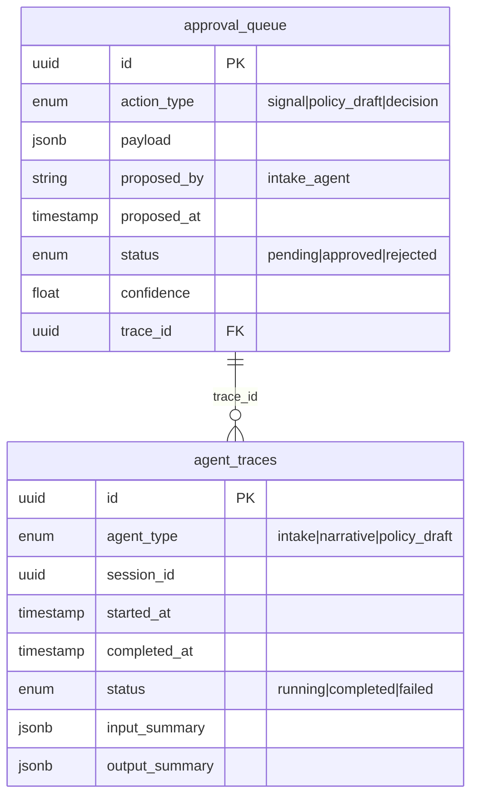

# feat: Add Signal Submission UI for Intake Agent

**Issue:** [#46](https://github.com/Silveroboros-dev/Governance-OS/issues/46)
**Type:** Feature
**Priority:** P1
**Areas:** frontend, ai, backend

---

## Overview

The backend has full intake agent capabilities from Sprint 3, but the frontend has no UI to submit new signals. Users can only view pre-seeded demo data - they cannot ingest their own documents.

This plan proposes a **UI-first implementation with API support** that aligns with the product's UI doctrine while enabling programmatic access.

---

## Problem Statement

Without signal submission, the app is demo-only. The core user journey is incomplete:

```
❌ Submit document → ✅ See exception → ✅ Make decision → ✅ View evidence
```

**User Impact:** The product cannot be evaluated with real documents, limiting its value proposition.

---

## Proposed Solution: Hybrid (UI + API)

### Recommendation from SpecFlow Analysis

| Principle | UI Approach | API-Only | MCP-Only |
|-----------|-------------|----------|----------|
| **"LLMs are optional coprocessors"** | ✅ Human initiates | ✅ | ⚠️ Risk of autonomous triggering |
| **"Uncertainty is first-class"** | ✅ Best - UI displays confidence | Depends on client | Depends on client |
| **Accessibility** | ✅ Best | Limited to technical users | Limited to MCP-aware systems |

**Decision:** UI + API hybrid. MCP as secondary interface later.

**Rationale:**
- UI provides natural human-in-the-loop checkpoint at input stage
- API enables programmatic workflows (email pipelines, batch processing)
- Both go through the same approval queue - safety invariant preserved
- UI doctrine ("one-screen commitment") applies to decisions, not inputs

---

## Technical Approach

### Architecture

```
┌─────────────────────────────────────────────────────────────┐
│                     USER INTERFACES                          │
├────────────────────┬────────────────────────────────────────┤
│      Web UI        │              API                        │
│  /ingest           │   POST /api/v1/intake/process          │
│  (primary path)    │   (programmatic access)                │
└─────────┬──────────┴──────────────┬─────────────────────────┘
          │                         │
          └────────────┬────────────┘
                       │
           ┌───────────▼───────────┐
           │     IntakeAgent       │
           │   (already exists)    │
           │   coprocessor/agents/ │
           └───────────┬───────────┘
                       │
           ┌───────────▼───────────┐
           │    Approval Queue     │
           │   (already exists)    │
           └───────────────────────┘
```

### Files to Create/Modify

| File | Action | Description |
|------|--------|-------------|
| `ui/app/ingest/page.tsx` | CREATE | Main submission UI |
| `core/api/intake.py` | CREATE | REST endpoint wrapper |
| `core/schemas/intake.py` | CREATE | Request/response Pydantic schemas |
| `ui/lib/api.ts` | MODIFY | Add intake API methods |
| `ui/lib/types.ts` | MODIFY | Add TypeScript types |
| `ui/components/nav.tsx` | MODIFY | Add navigation entry |

---

## Implementation Phases

### Phase 1: Backend API Endpoint

Create REST endpoint that wraps the existing IntakeAgent.

#### `core/schemas/intake.py`

```python
from pydantic import BaseModel, Field
from typing import Optional, List
from enum import Enum

class Pack(str, Enum):
    treasury = "treasury"
    wealth = "wealth"

class IntakeProcessRequest(BaseModel):
    """Request to process a document through the intake agent."""
    document_text: str = Field(..., min_length=50, max_length=50000)
    pack: Pack
    document_source: Optional[str] = Field(None, max_length=500)

class ExtractedSignalResponse(BaseModel):
    """A signal extracted by the intake agent."""
    signal_type: str
    payload: dict
    confidence: float
    source_spans: List[dict]
    requires_verification: bool  # True if confidence < 0.7

class IntakeProcessResponse(BaseModel):
    """Response from intake processing."""
    signals: List[ExtractedSignalResponse]
    approval_ids: List[str]  # UUIDs of created approval queue entries
    processing_time_ms: int
    warnings: List[str] = []
```

#### `core/api/intake.py`

```python
from fastapi import APIRouter, HTTPException, Depends
from sqlalchemy.orm import Session
from core.database import get_db
from core.schemas.intake import IntakeProcessRequest, IntakeProcessResponse
from coprocessor.agents.intake_agent import IntakeAgent
import time

router = APIRouter(prefix="/intake", tags=["intake"])

@router.post("/process", response_model=IntakeProcessResponse)
def process_document(
    request: IntakeProcessRequest,
    db: Session = Depends(get_db)
):
    """
    Process a document through the intake agent to extract signals.

    All extracted signals go to the approval queue for human review.
    This endpoint does NOT create signals directly.
    """
    start_time = time.time()

    try:
        agent = IntakeAgent(pack=request.pack.value)
        result = agent.process(
            content=request.document_text,
            document_source=request.document_source or "user_submission"
        )

        # Result contains approval_ids for queued signals
        processing_time_ms = int((time.time() - start_time) * 1000)

        return IntakeProcessResponse(
            signals=[
                ExtractedSignalResponse(
                    signal_type=s.signal_type,
                    payload=s.payload,
                    confidence=s.confidence,
                    source_spans=s.source_spans,
                    requires_verification=s.confidence < 0.7
                )
                for s in result.extracted_signals
            ],
            approval_ids=result.approval_ids,
            processing_time_ms=processing_time_ms,
            warnings=result.warnings or []
        )

    except ValueError as e:
        raise HTTPException(status_code=400, detail=str(e))
    except Exception as e:
        raise HTTPException(status_code=500, detail=f"Processing failed: {str(e)}")
```

### Phase 2: Frontend UI

#### `ui/app/ingest/page.tsx`

```tsx
'use client'

import { useState, FormEvent } from 'react'
import { Loader2, FileText, CheckCircle, AlertTriangle } from 'lucide-react'
import { Button } from '@/components/ui/button'
import { Textarea } from '@/components/ui/textarea'
import { Card, CardContent, CardHeader, CardTitle, CardDescription } from '@/components/ui/card'
import { Badge } from '@/components/ui/badge'
import { Label } from '@/components/ui/label'
import { Input } from '@/components/ui/input'
import { usePack } from '@/lib/pack-context'
import { cn } from '@/lib/utils'
import Link from 'next/link'

interface ExtractedSignal {
  signal_type: string
  payload: Record<string, any>
  confidence: number
  source_spans: { start: number; end: number; text: string }[]
  requires_verification: boolean
}

interface ProcessResult {
  signals: ExtractedSignal[]
  approval_ids: string[]
  processing_time_ms: number
  warnings: string[]
}

type Status = 'idle' | 'processing' | 'success' | 'error'

export default function IngestPage() {
  const { pack } = usePack()
  const [documentText, setDocumentText] = useState('')
  const [documentSource, setDocumentSource] = useState('')
  const [status, setStatus] = useState<Status>('idle')
  const [error, setError] = useState<string | null>(null)
  const [result, setResult] = useState<ProcessResult | null>(null)

  async function handleSubmit(event: FormEvent<HTMLFormElement>) {
    event.preventDefault()

    if (documentText.trim().length < 50) {
      setError('Please enter at least 50 characters')
      return
    }

    setStatus('processing')
    setError(null)
    setResult(null)

    try {
      const response = await fetch(
        `${process.env.NEXT_PUBLIC_API_URL || 'http://localhost:8000/api/v1'}/intake/process`,
        {
          method: 'POST',
          headers: { 'Content-Type': 'application/json' },
          body: JSON.stringify({
            document_text: documentText,
            pack: pack,
            document_source: documentSource || undefined,
          }),
        }
      )

      if (!response.ok) {
        const errorData = await response.json().catch(() => ({}))
        throw new Error(errorData.detail || `Processing failed (${response.status})`)
      }

      const data: ProcessResult = await response.json()
      setResult(data)
      setStatus('success')
    } catch (err) {
      setError(err instanceof Error ? err.message : 'An unexpected error occurred')
      setStatus('error')
    }
  }

  const isProcessing = status === 'processing'

  return (
    <div className="container mx-auto px-4 py-8">
      <div className="max-w-4xl mx-auto space-y-6">
        {/* Header */}
        <div>
          <h1 className="text-3xl font-bold tracking-tight">Submit Document</h1>
          <p className="text-muted-foreground mt-2">
            Paste a document to extract structured signals for {pack} pack
          </p>
        </div>

        {/* Form Card */}
        <Card>
          <CardHeader>
            <CardTitle className="flex items-center gap-2">
              <FileText className="h-5 w-5" />
              Document Input
            </CardTitle>
            <CardDescription>
              AI will analyze the document and extract signals. All extractions go to the approval queue for your review.
            </CardDescription>
          </CardHeader>
          <CardContent>
            <form onSubmit={handleSubmit} className="space-y-6">
              {/* Document Source (optional) */}
              <div className="space-y-2">
                <Label htmlFor="source">Document Source (optional)</Label>
                <Input
                  id="source"
                  value={documentSource}
                  onChange={(e) => setDocumentSource(e.target.value)}
                  placeholder="e.g., Q4 Board Meeting, CFO Email, Risk Report"
                  disabled={isProcessing}
                />
              </div>

              {/* Document Textarea */}
              <div className="space-y-2">
                <Label htmlFor="document">Document Content</Label>
                <Textarea
                  id="document"
                  value={documentText}
                  onChange={(e) => setDocumentText(e.target.value)}
                  placeholder="Paste your document here (memos, reports, correspondence, etc.)..."
                  className={cn(
                    "min-h-[300px] font-mono text-sm resize-y",
                    error && "border-destructive"
                  )}
                  disabled={isProcessing}
                />
                <div className="flex justify-between text-xs text-muted-foreground">
                  <span>Minimum 50 characters required</span>
                  <span>{documentText.length.toLocaleString()} / 50,000</span>
                </div>
              </div>

              {/* Error Display */}
              {error && (
                <div className="flex items-center gap-2 rounded-md bg-destructive/15 p-4 text-destructive">
                  <AlertTriangle className="h-5 w-5 flex-shrink-0" />
                  <p className="text-sm">{error}</p>
                </div>
              )}

              {/* Processing Indicator */}
              {isProcessing && (
                <div className="flex items-center gap-3 p-4 bg-muted rounded-lg">
                  <Loader2 className="h-5 w-5 animate-spin text-primary" />
                  <div>
                    <p className="font-medium">Analyzing document...</p>
                    <p className="text-sm text-muted-foreground">
                      AI extraction may take 10-30 seconds
                    </p>
                  </div>
                </div>
              )}

              {/* Submit Button */}
              <Button
                type="submit"
                disabled={isProcessing || documentText.trim().length < 50}
                className="w-full"
                size="lg"
              >
                {isProcessing ? (
                  <>
                    <Loader2 className="mr-2 h-4 w-4 animate-spin" />
                    Processing...
                  </>
                ) : (
                  'Extract Signals'
                )}
              </Button>
            </form>
          </CardContent>
        </Card>

        {/* Results Display */}
        {result && (
          <Card className="border-green-500/50">
            <CardHeader>
              <CardTitle className="flex items-center gap-2 text-green-600">
                <CheckCircle className="h-5 w-5" />
                Extraction Complete
              </CardTitle>
              <CardDescription>
                Extracted {result.signals.length} signal(s) in {(result.processing_time_ms / 1000).toFixed(1)}s
              </CardDescription>
            </CardHeader>
            <CardContent className="space-y-4">
              {/* Warnings */}
              {result.warnings.length > 0 && (
                <div className="rounded-md bg-yellow-500/15 p-4">
                  <ul className="list-disc list-inside text-sm text-yellow-700">
                    {result.warnings.map((w, i) => <li key={i}>{w}</li>)}
                  </ul>
                </div>
              )}

              {/* Zero signals case */}
              {result.signals.length === 0 && (
                <div className="text-center py-8 text-muted-foreground">
                  <p>No signals could be extracted from this document.</p>
                  <p className="text-sm mt-2">Try a document with more specific {pack} content.</p>
                </div>
              )}

              {/* Extracted Signals */}
              <div className="space-y-3">
                {result.signals.map((signal, index) => (
                  <div key={index} className="rounded-lg border p-4 space-y-3">
                    <div className="flex items-start justify-between">
                      <h4 className="font-medium">
                        {signal.signal_type.replace(/_/g, ' ')}
                      </h4>
                      <div className="flex items-center gap-2">
                        {signal.requires_verification && (
                          <Badge variant="outline" className="text-yellow-600 border-yellow-600">
                            Needs Review
                          </Badge>
                        )}
                        <Badge className={cn(
                          signal.confidence >= 0.7 ? 'bg-green-500' : 'bg-yellow-500',
                          'text-white'
                        )}>
                          {(signal.confidence * 100).toFixed(0)}%
                        </Badge>
                      </div>
                    </div>

                    {/* Source Spans */}
                    {signal.source_spans.length > 0 && (
                      <div>
                        <p className="text-xs font-medium text-muted-foreground mb-1">Source</p>
                        {signal.source_spans.map((span, i) => (
                          <blockquote key={i} className="border-l-2 pl-3 text-sm italic text-muted-foreground">
                            "{span.text}"
                          </blockquote>
                        ))}
                      </div>
                    )}
                  </div>
                ))}
              </div>

              {/* Navigation to Approval Queue */}
              {result.approval_ids.length > 0 && (
                <div className="pt-4 border-t">
                  <Link href="/approvals">
                    <Button variant="outline" className="w-full">
                      View in Approval Queue ({result.approval_ids.length} pending)
                    </Button>
                  </Link>
                </div>
              )}
            </CardContent>
          </Card>
        )}
      </div>
    </div>
  )
}
```

### Phase 3: Integration

1. **Add navigation entry** in `ui/components/nav.tsx`
2. **Add API types** to `ui/lib/types.ts`
3. **Add API methods** to `ui/lib/api.ts`
4. **Register router** in `core/main.py`

---

## Acceptance Criteria

### Functional Requirements
- [ ] User can paste document text (50-50,000 characters)
- [ ] User can optionally provide document source
- [ ] Pack selector uses current pack context
- [ ] Submission triggers intake agent processing
- [ ] User sees extracted signals with confidence scores
- [ ] Signals with confidence < 0.7 show "Needs Review" badge
- [ ] Source spans are displayed for each signal
- [ ] User can navigate to approval queue
- [ ] Error handling for failed extractions

### Non-Functional Requirements
- [ ] Processing timeout: 60 seconds max
- [ ] Character count displayed
- [ ] Loading state during processing
- [ ] Accessible form (WCAG 2.2 AA)

### Quality Gates
- [ ] Integration test for full flow
- [ ] Error boundary for page
- [ ] API endpoint tests

---

## Open Questions Resolved

| Question | Decision |
|----------|----------|
| Max document size? | 50,000 characters |
| Authentication required? | No (matches approval UI pattern) |
| Document source? | Optional user-provided field |
| Zero signals behavior? | Show informational message |
| Confidence visualization? | Badge with color coding, "Needs Review" label |
| Results persistence? | Ephemeral - only approved signals persist |

---

## References

### Internal Files
- Existing IntakeAgent: `coprocessor/agents/intake_agent.py:87-161`
- Approval Queue API: `core/api/approvals.py`
- Pack Context: `ui/lib/pack-context.tsx`
- Existing form patterns: `ui/app/approvals/page.tsx:432-474`

### External Documentation
- [Next.js 14 Forms](https://nextjs.org/docs/app/building-your-application/data-fetching/server-actions-and-mutations)
- [Confidence Visualization Patterns](https://agentic-design.ai/patterns/ui-ux-patterns/confidence-visualization-patterns)
- [Human-in-the-Loop AI Design](https://zapier.com/blog/human-in-the-loop/)

---

## ERD: New Schema Elements



No new tables required - uses existing Sprint 3 schema.
